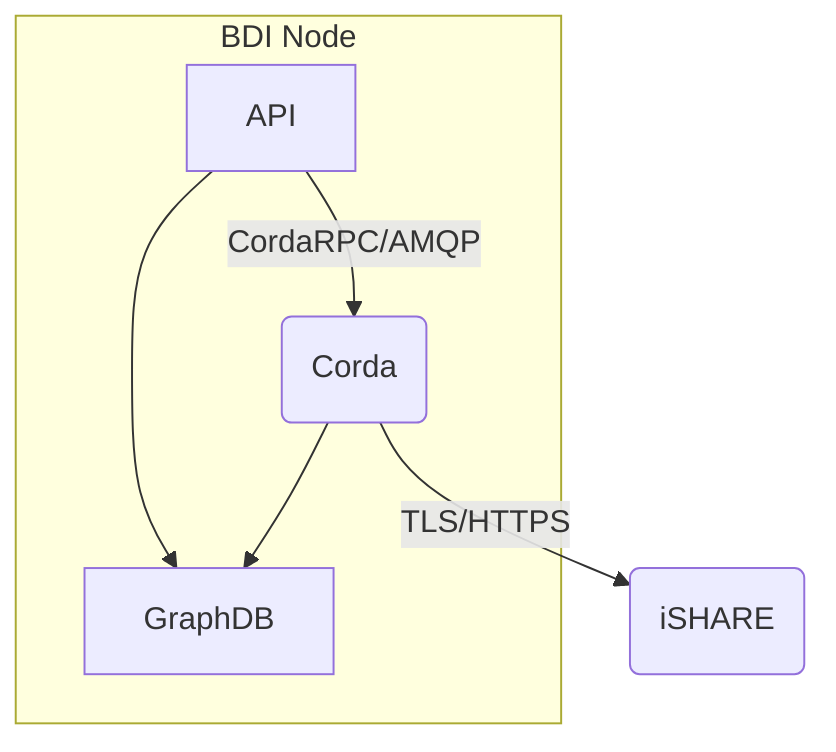

# Docker BDI Node

This repository contains the necessary files to configure a BDI node and run it via docker compose.

## Components

The BDI node is composed by the following components:

- API
- Corda
- GraphDB



> **Note**: TLS can be enabled for the CordaRPC connection.

## Configuration

Overview of the BDI node configuration files:

| File                                                   | Description                                                              |
|--------------------------------------------------------|--------------------------------------------------------------------------|
| [corda/database.properties](corda/database.properties) | Triple store connection properties                                       | 
| [corda/ishare.properties](corda/ishare.properties)     | iSHARE configuration properties                                          |
| [corda/node.conf](corda/node.conf)                     | Corda node.conf configuration file                                       |
| [.env](.env)                                           | Docker compose env properties, contains BDI API configuration properties | 


> **Important**: Make sure to restart the docker containers after changing any of the properties.

For more details regarding the off-the-shelf components that have been used, please refer to the corresponding documentation:

| Component                  | Link                                                                   |
|----------------------------|------------------------------------------------------------------------|
| Corda R3 community edition | https://docs.r3.com/en/platform/corda/4.9/community.html               |
| GraphDB free               | https://graphdb.ontotext.com/documentation/10.1/                       |
| Spring Boot                | https://docs.spring.io/spring-boot/docs/current/reference/htmlsingle/  |


### Node Identity

You can configure the identity of the Corda node through the [node.conf](corda/node.conf) file. You can change the name and location of the organization, and you must set the host name or IP address of the node. 

### GraphDB

The Corda node communicates with an instance of GraphDB. In the default configuration it is assumed that GraphDB and the Corda node are running in the same network (in this case the virtual one created by docker). 
Should this not be the case, you can configure GraphDB's location by editing [corda/database.properties](corda/database.properties) folder, and alter the `triplestore.host` property.

### iSHARE

iSHARE can be enabled for the communication between Corda nodes. All the iSHARE related properties are in the [corda/ishare.properties](corda/ishare.properties) file. To enable iSHARE set `ishare.enabled=true`, next to that make sure to specify the other mandatory iSHARE properties.

## Registration to the Network

> **Important**: you don't need to run this step if the node is already registered to the network - for instance, if you already registered it, and now you are restarting the node.

After configuring your node identity, you can register your node:

```
docker compose --profile registration up
```

Once the process ends successfully, the node is registered to the network and new certificates are created. After starting your node, you can see the network-map service at: https://nms.k8s.basicdatasharinginfrastructure.net/

## Run the BDI Node

Run the BDI node using the following docker compose command:

```
docker compose --profile run up
```

This will start the BDI-API, Corda node and GraphDB containers. Startup might take some time, so be patient.

## Testing the BDI API

The BDI API provides a Swagger interface that allows for interacting with the BDI API. 
After the docker containers are up and running navigate to http://localhost:10050/swagger-ui.html in your browser, the Swagger UI should appear.

### Corda endpoints

Under Corda details, one can query the Corda node what nodes it knows. It should know at least one notary (GET `/node/notaries`) and a few other nodes (GET `/node/peers`).

### Events endpoints

The `/events` endpoint allows for sending events to the BDI node. Below is an example event that 
can be submitted to the `/events` endpoint:

```bash
curl -X POST --location "http://localhost:10050/events" \
    -H "Content-Type: application/json" \
    -H "Event-Type: federated.events.arrival-event.v1" \
    -d "{
            \"timestamp\": \"2023-09-27T08:50:00.000+02:00\",
            \"timeClassification\": \"Planned\",
            \"involvedActors\": [
                {
                    \"actorLegalPerson\": {
                        \"postalCode\": \"5656AE\",
                        \"locatedAtStreetName\": \"High Tech Campus\",
                        \"postalAddress\": \"HTC 25, 5656 AE Eindhoven\",
                        \"locatedInCountry\": \"NL\",
                        \"locatedInCity\": \"Eindhoven\",
                        \"legalPersonName\": \"TNO\",
                        \"legalPersonID\": \"TNO-NL\"
                    },
                    \"actorLogisticsRole\": \"Consignor\"
                },
                {
                    \"actorLegalPerson\": {
                        \"postalCode\": \"37137\",
                        \"locatedAtStreetName\": \"Via Sommacampagna 32\",
                        \"postalAddress\": \"Via Sommacampagna 32\",
                        \"locatedInCountry\": \"IT\",
                        \"locatedInCity\": \"Verona\",
                        \"legalPersonName\": \"Verona Quadrante Europa TVR\",
                        \"legalPersonID\": \"VQETVR-IT\"
                    },
                    \"actorLogisticsRole\": \"Consignee\"
                },
                {
                    \"actorLegalPerson\": {
                        \"postalCode\": \"8660\",
                        \"locatedAtStreetName\": \"Godthåbsvej 19\",
                        \"postalAddress\": \"Godthåbsvej 19\",
                        \"locatedInCountry\": \"DK\",
                        \"locatedInCity\": \"Skanderborg\",
                        \"legalPersonName\": \"WAYS Logistics A/S\",
                        \"legalPersonID\": \"WLAS-DK\"
                    },
                    \"actorLogisticsRole\": \"Carrier\"
                }
            ],
            \"transportMeans\": [
                {
                    \"digitalTwinID\": \"X-040-TNO\",
                    \"transportMeansMode\": \"Road\",
                    \"hasTransportmeansNationality\": \"NL\"
                }
            ],
            \"involvedLocation\": {
                \"locationRole\": \"PlaceOfArrival\",
                \"postalCode\": \"37137\",
                \"locatedAtStreetName\": \"Via Sommacampagna 32\",
                \"postalAddress\": \"Via Sommacampagna 32\",
                \"locatedInCountry\": \"IT\",
                \"locatedInCity\": \"Verona\"
            }
        }"
```

## Run the Corda migration database (optional)

In case you want to rebuild the corda datastore, run the command below. Make sure to stop the corda bdi node first:

```
docker compose --profile db up
```
